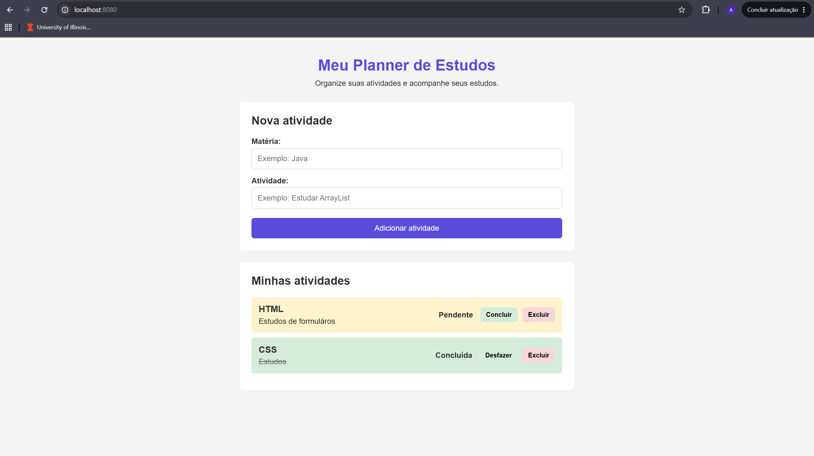

# 📚 Meu Planner de Estudos

Aplicação web desenvolvida como projeto de estudo com o objetivo de praticar conceitos de **desenvolvimento frontend e backend**, utilizando HTML, CSS, JavaScript, Java e Spring Boot.

O sistema permite cadastrar, visualizar, concluir, desfazer e excluir atividades de estudo.

Este projeto representa minha primeira experiência integrando uma interface web com uma **API REST desenvolvida em Java**.

---

## 🚀 Funcionalidades

* Cadastrar novas atividades
* Informar matéria e descrição da atividade
* Listar atividades cadastradas
* Marcar atividade como concluída
* Desfazer conclusão
* Excluir atividades
* Validação de campos vazios
* Comunicação entre frontend e backend através de API REST

---

## 🛠️ Tecnologias utilizadas

### Frontend

* HTML5
* CSS3
* JavaScript

### Backend

* Java 21
* Spring Boot
* Spring Web
* API REST
* Maven

### Ferramentas

* IntelliJ IDEA
* Google Chrome / DevTools
* PowerShell
* Git e GitHub

---

## 🧩 Estrutura do projeto

```text
planner-estudos
│
├── src
│   └── main
│       ├── java
│       │   └── com.planner.estudos
│       │       │
│       │       ├── controller
│       │       │   └── TarefaController.java
│       │       │
│       │       ├── model
│       │       │   └── Tarefa.java
│       │       │
│       │       └── PlannerEstudosApplication.java
│       │
│       └── resources
│           ├── static
│           │   ├── index.html
│           │   ├── style.css
│           │   └── script.js
│           │
│           └── application.properties
│
├── pom.xml
├── mvnw
├── mvnw.cmd
└── .gitignore
```

---

## 🔄 Como o projeto funciona

O frontend é responsável pela interface utilizada pelo usuário.

```text
HTML
+
CSS
+
JavaScript
```

O JavaScript utiliza `fetch()` para realizar requisições para a API desenvolvida com Spring Boot.

```text
Frontend
   ↓
JavaScript / fetch()
   ↓
API REST
   ↓
Spring Boot
   ↓
TarefaController
   ↓
Tarefa
```

---

## 🌐 API REST

A aplicação possui as seguintes rotas:

| Método   | Endpoint        | Função                  |
| -------- | --------------- | ----------------------- |
| `GET`    | `/tarefas`      | Listar todas as tarefas |
| `POST`   | `/tarefas`      | Criar uma nova tarefa   |
| `PUT`    | `/tarefas/{id}` | Atualizar uma tarefa    |
| `DELETE` | `/tarefas/{id}` | Excluir uma tarefa      |

### Exemplo de tarefa

```json
{
  "id": 1,
  "materia": "Java",
  "atividade": "Estudar Spring Boot",
  "concluida": false
}
```

---

## 💻 Como executar o projeto

### Pré-requisitos

Para executar o projeto é necessário possuir:

* Java 21
* IntelliJ IDEA ou outra IDE compatível com Java
* Maven ou utilizar o Maven Wrapper incluído no projeto

### Execução

1. Clone ou baixe este repositório.

2. Abra o projeto em sua IDE.

3. Execute a classe:

```text
PlannerEstudosApplication.java
```

4. Aguarde o Spring Boot iniciar o servidor.

5. Abra o navegador e acesse:

```text
http://localhost:8080
```

A API também pode ser acessada diretamente em:

```text
http://localhost:8080/tarefas
```

---

## 📸 Demonstração

> Adicionar aqui um print da aplicação funcionando.

```markdown

```

---

## 🧠 Conceitos praticados

Durante o desenvolvimento deste projeto pratiquei conceitos como:

* Estruturação de páginas com HTML
* Estilização com CSS
* Manipulação do DOM
* Eventos em JavaScript
* Arrays e objetos
* Funções assíncronas
* `async` e `await`
* Requisições com `fetch()`
* Programação orientada a objetos em Java
* Classes, atributos, construtores, getters e setters
* `ArrayList`
* Spring Boot
* Controllers
* Annotations
* API REST
* Métodos HTTP
* JSON
* Integração entre frontend e backend
* Operações CRUD

---

## 📌 Sobre esta versão

### Versão 1.0

Nesta primeira versão, as tarefas são armazenadas **em memória no backend**.

Isso significa que os dados permanecem disponíveis enquanto a aplicação estiver em execução, mas são apagados quando o servidor Spring Boot é reiniciado.

O objetivo desta versão foi desenvolver e compreender todo o fluxo:

```text
Interface
→ JavaScript
→ API REST
→ Spring Boot
→ Java
```

---

## 🔮 Próximas versões

Algumas melhorias planejadas para futuras versões:

* Integração com banco de dados
* Spring Data JPA
* PostgreSQL ou MySQL
* Validações no backend
* Tratamento de erros da API
* Busca e filtros de tarefas
* Edição de atividades
* Melhorias de responsividade
* Deploy da aplicação

---

## 🎯 Objetivo do projeto

Este projeto foi desenvolvido como parte do meu processo de aprendizado e construção de portfólio na área de tecnologia.

O objetivo foi aplicar na prática conhecimentos de **HTML, CSS, JavaScript e Java**, além de compreender como o frontend de uma aplicação se comunica com um backend através de uma API REST.

---

## 👩‍💻 Autora

**Andreia Franco**

Projeto desenvolvido para fins de estudo, prática e portfólio.
